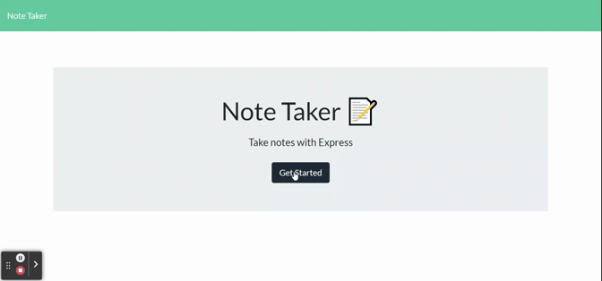

# Note Taker

## A web app to save your daily notes


<a href="https://img.shields.io/badge/JavaScipt-100%25-yellow"></a> <a href="https://img.shields.io/badge/Used-Node.js-red"></a> <a href="https://img.shields.io/badge/Used-express.js-orange"></a> <a href="https://img.shields.io/badge/Used-heroku-informational"></a>

## Table of Contents

- [Description](#description)
- [Installation](#installation)
- [Usage](#usage)
- [Contribution](#contribution)
- [Test Instructions](#test-instructions)
- [License](#license)
- [Contact Information](#contact-information)

## Description

    Note taker is a web based app to keep notes, reminder of a task or shopping list and can be used by user in any device with internet connection

## Installation  

### The app is deployed in `Heroku` and can be used via the link below.
#### [Note Taker APP Click Here !!!](https://enigmatic-badlands-88370.herokuapp.com/)
#### To run this code repo in your PC, user must install Node.js first  
#### User also need the following dependencies

    * Express
    * Jest (To run test)

- open terminal
- clone the repo: `https://github.com/thossain89/Note_Taker.git`
- cd into new directory (Must be in directory to work) 
- Download Express package by entering `npm install express`
- Download Jest package by entering `npm install jest`
- enter `node server.js` in cmd
- use Insomnia or program of your choice to check the code.

## Usage


```
Its a simple app. Enter a subject at the title header and your preferred text in the body. A save button will appear at top and by clicking it the file will be saved on the left hand side column. If you want to delete any older notes just click delete icon beside the note and it will be deleted.
```


## Demo of Note Taker :

  


## Contribution

If you would like to contribute to this project reach out to me. Contact Information can be found below or by clicking on the 'Contact-Information' link provided in the Table of Contents.

## Test Instructions
#### For testing user must install Jest dependency in Node.js module
#### You must Download jest to conduct any test in this repo  
- Download jest in cmd by running the code `npm install jest`
- Then run: `npm run test` in console


## License

<a href="https://img.shields.io/badge/License-MIT-brightgreen"></a>

## Contact Information

[Email Address](tanvirhossain2006@gmail.com)

[Github Repo ReadMe Generator](https://github.com/thossain89/Team_Profile_Generator.git)

## Authors   

  


* **Tanvir hossain** [Git Hub Profile](https://github.com/thossain89)  

&copy; 2021 Tanvir Hossain, Coding Bootcamp ,University of Sydney and Trilogy Education
